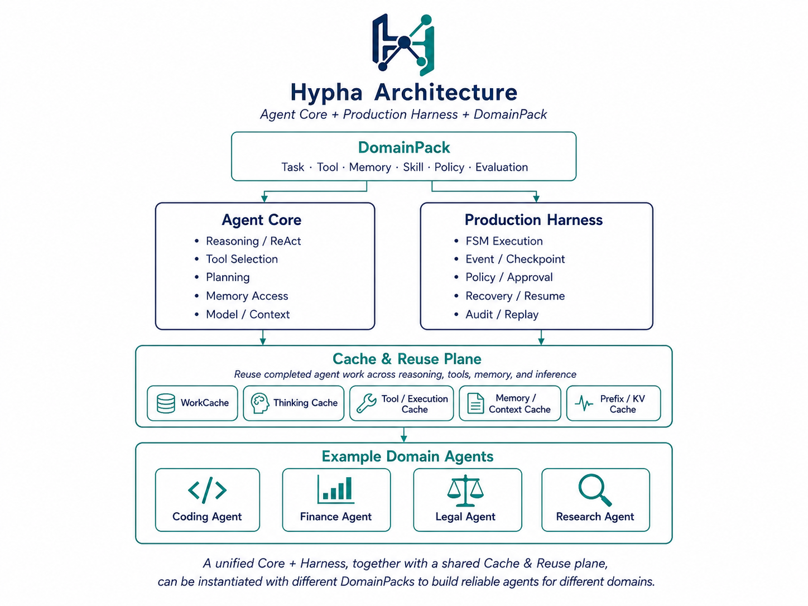
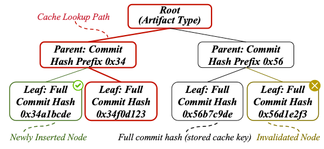
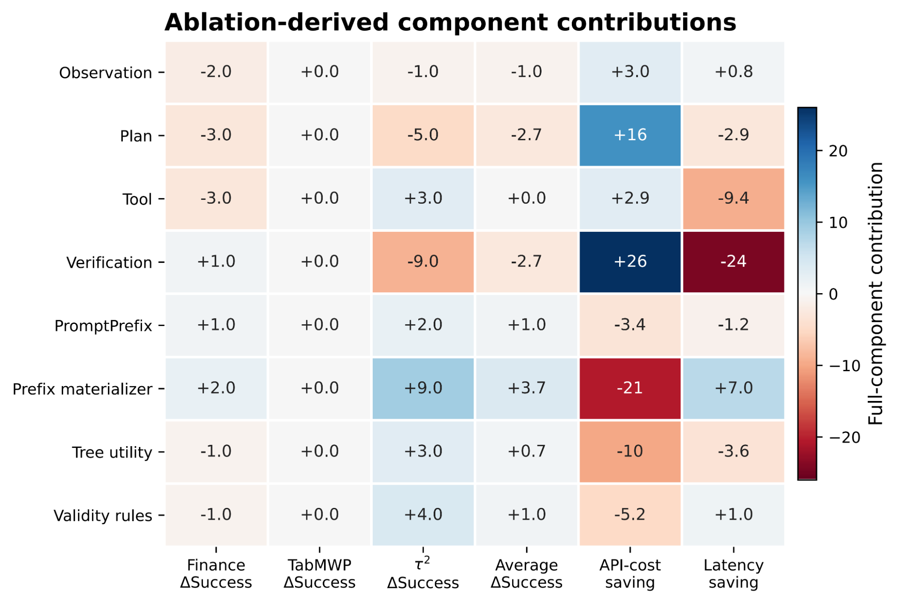

<p align="center">
  
</p>

<p align="center">
  <strong>Agent Core + Production Harness for governed, durable, and reusable domain agents.</strong>
</p>

<p align="center">
  <sub>DomainPack · Event-first Runtime · Governed Capabilities · Recovery · Cache & Reuse</sub>
</p>

<p align="center">
  English | <a href="README.zh-CN.md">中文</a>
</p>

<p align="center">
  <a href="https://codesoul-co.github.io/Hypha/"><strong>User Guide</strong></a>
  · <a href="https://hypha.code-soul.com/"><strong>Official Website</strong></a>
  · <a href="https://github.com/CodeSoul-co/Hypha/releases/tag/v1.0.1">Release v1.0.1</a>
  · <a href="https://www.npmjs.com/org/codesoul-co">npm Packages</a>
</p>

> **Current public release:** v1.0.1, with 15 aligned packages named
> `@codesoul-co/hypha-*`. The [versioned user guide](https://codesoul-co.github.io/Hypha/)
> includes an API atlas for every package, custom FSM control, and a complete composition example.

## What is hypha?

hypha is an open-source TypeScript framework built around two cooperating layers: an **Agent Core**
and a **Production Harness**. The Agent Core handles reasoning/ReAct, planning, tool selection, Memory
access, and model/context orchestration; the Production Harness turns those decisions into bounded,
event-backed execution with FSM control, policy/approval, checkpoints, recovery, replay, and audit.

Product-specific behavior is declared through a `DomainPack`, not hard-coded into the runtime. A
DomainPack compiles tasks, workflows, capabilities, prompts, Memory, policy, evaluation, and output
contracts into the shared Core + Harness. A cross-cutting **Cache & Reuse Plane** then reuses
validated work across reasoning, tools, Memory, execution, and inference while remaining a disposable
projection: cache state can accelerate execution, but it can never become authority or replace Event,
Artifact, receipt, or checkpoint evidence.

## Architecture at a glance

<p align="center">
  
</p>

<p align="center">
  <em>One Agent Core + Production Harness can be instantiated with different DomainPacks, while the
  Cache & Reuse Plane spans reasoning, tools, Memory, execution, and inference.</em>
</p>

| Layer                   | Primary responsibility                                                                                                                                                      |
| ----------------------- | --------------------------------------------------------------------------------------------------------------------------------------------------------------------------- |
| **Agent Core**          | Reasoning/ReAct, planning, tool selection, Memory access, model and context orchestration.                                                                                  |
| **Production Harness**  | FSM execution, Event/checkpoint control, policy/approval, continuation, recovery, audit, and replay.                                                                        |
| **DomainPack**          | Declares the product-specific task, workflow, capability, Memory, Skill, Prompt, Policy, evaluation, and output contracts compiled into the shared runtime.                 |
| **Cache & Reuse Plane** | Reuses validated model work, reasoning structures, tool/execution results, Memory/context projections, and prefix/KV state without becoming a source of truth or authority. |

This separation is what lets the same runtime support very different agent products. A coding agent,
finance agent, legal agent, or research agent can share the same Core + Harness while changing the
DomainPack, capability bindings, policies, evaluation contracts, and domain-specific state.

## Cache management and typed cache trees

Cache is a first-class control plane in hypha, not a single response-cache feature. The system
distinguishes several reuse layers because an exact LLM response, a reasoning subgraph, a tool result,
a Memory projection, and a KV prefix have different validity and invalidation requirements.

| Cache layer                | Reusable unit                                                      | Typical validity boundary                                                                                     |
| -------------------------- | ------------------------------------------------------------------ | ------------------------------------------------------------------------------------------------------------- |
| **Serving Cache**          | Exact normalized model response                                    | Model/provider identity, normalized request, scope, TTL, and response validity.                               |
| **Thinking Cache**         | Reasoning node, path, or reusable subgraph                         | Model/provider, reasoning strategy/version, prompt blocks, tool schema, inference parameters, and scope.      |
| **WorkCache**              | Event-derived typed agent work                                     | Source-event provenance, dependency/revision closure, scope, validity state, and future demand.               |
| **Tool / Execution Cache** | Eligible read-only tool results or deterministic execution results | Capability revision, Policy, external-state evidence, workspace/environment snapshot, idempotency, and scope. |
| **Memory / Context Cache** | Memory search and assembled context projections                    | Memory scope, mutation generation, source revision, provenance, and context policy.                           |
| **Prefix / KV Cache**      | Prompt-prefix blocks, provider prefixes, or backend KV segments    | Model/backend, Agent/Session/Domain scope, prompt dependencies, and prefix/KV revision.                       |

<p align="center">
  
</p>

A cache tree uses a typed root to partition reusable artifacts, compact parent nodes to route lookups
by hash prefix, and full logical keys at the leaves. New leaves can be inserted without rebuilding
unrelated branches, while stale leaves can be invalidated locally; the physical tree is therefore a
lookup structure, while Event and Artifact evidence remain the source of truth.

WorkCache extends that lookup pattern into **semantic cache trees** for agent execution:

| Semantic tree      | What it reuses                                                                                                         |
| ------------------ | ---------------------------------------------------------------------------------------------------------------------- |
| `PlanTree`         | Plans, plan branches, and reusable planning artifacts.                                                                 |
| `ComputationTree`  | Reasoning/computation nodes and derived work; also the natural backing plane for Thinking Cache.                       |
| `ToolTree`         | Eligible tool-call results and their provenance/validity metadata.                                                     |
| `ObservationTree`  | Reusable observations tied to source evidence and scope.                                                               |
| `VerificationTree` | Verification, checking, and output-validation work.                                                                    |
| `MemoryTree`       | Memory-derived projections whose validity follows Memory mutation generations and scope.                               |
| `RecoveryTree`     | Recovery knowledge keyed by failure context and relevant runtime revisions; hits are advisory and must be revalidated. |
| `PromptPrefixTree` | Stable prompt blocks and prefix materialization used by provider/backend prefix reuse.                                 |

The central invariant is **reuse without authority**. A hit may avoid recomputation, but it cannot
authorize a Tool, skip Policy or Approval, fabricate a receipt, advance the FSM, or replace Event and
Artifact evidence. Cache lookup, validation, invalidation, and bypass are therefore part of runtime
control rather than hidden implementation details.

## Cache diagnostics across benchmarks

<p align="center">
  
</p>

<p align="center">
  <em>Ablation-derived component contributions across task success, API-cost saving, and latency saving.</em>
</p>

## Tau3 benchmark results

The latest three-way comparison was run against Hypha `main@ef33263` with one trial per task
(385 tasks total). The base model was `deepseek-v4-flash`. Hypha is the framework result and
Direct is the direct model-call baseline. Neither arm reported a system error.

| Benchmark         |   Tasks |               Hypha |              Direct |
| ----------------- | ------: | ------------------: | ------------------: |
| Mock              |      10 |        0.800 (8/10) |        0.800 (8/10) |
| Airline           |      50 |       0.880 (44/50) |       0.900 (45/50) |
| Retail            |     114 |     0.912 (104/114) |     0.895 (102/114) |
| Telecom           |     114 |      0.605 (69/114) |      0.588 (67/114) |
| Banking knowledge |      97 |       0.206 (20/97) |       0.196 (19/97) |
| **Total**         | **385** | **0.636 (245/385)** | **0.626 (241/385)** |

## Product model

| Concept      | Responsibility                                                                                                                               |
| ------------ | -------------------------------------------------------------------------------------------------------------------------------------------- |
| `DomainPack` | Declares tasks, workflows, output contracts, skills, tools, MCP, memory, context, policy, evaluation, regression, and deployment references. |
| `Agent`      | Selects model aliases and receives the capability references compiled from a DomainPack.                                                     |
| `Session`    | Holds user and product context. A Session references a DomainPack and optional Session profile.                                              |
| `Run`        | Represents one durable execution under a Session.                                                                                            |
| `Event`      | Records source-of-truth facts from which state, replay, audit, and regression views are projected.                                           |
| `Artifact`   | Stores content-addressed inputs, outputs, checkpoints, and execution evidence.                                                               |

The canonical execution path is:

```text
DomainPack
  -> validated bindings and dependency snapshot
  -> framework-owned Harness FSM
  -> bounded ReAct quantum and Domain pipeline evidence
  -> governed Tool / MCP / Memory / Execution activity
  -> Event + receipt + Artifact evidence
  -> projection, continuation, recovery, replay, and evaluation
```

No cache hit or provider response can authorize a side effect, advance the FSM, or replace Event and
Artifact evidence. Tool, MCP, Memory, file, execution, and external writes pass through policy,
trace, cancellation, deadline, idempotency, and harness boundaries.

## Included capabilities

| Area               | Included runtime capability                                                                                                                                                                              |
| ------------------ | -------------------------------------------------------------------------------------------------------------------------------------------------------------------------------------------------------- |
| Runtime            | ReAct + FSM, durable session commands, bounded continuation, timers, leases, fencing, cancellation, recovery workers, human review, replay, audit, and regression projections.                           |
| Domain             | YAML/JSON/TypeScript Domain Packs, runtime validation, overlays, registry, deterministic compiler, dependency snapshots, and Agent patches.                                                              |
| Memory             | Hypha Native Memory, local Native Lite, self-hosted Mem0 OSS, Mem0 Platform, and Vertex AI Memory Bank adapters behind one governed contract.                                                            |
| Tools and MCP      | Local, HTTP, plugin, mock, and MCP adapters through one governed invocation path with capability snapshots and drift control.                                                                            |
| Skills and prompts | Built-in, filesystem, package, and signed remote Skill registries; progressive loading; versioned prompt references and templates.                                                                       |
| Execution          | Provider-neutral Workspace, Sandbox, Command, Artifact, Store, lease, recovery, and cache contracts with local-process, Docker, remote HTTP, SQLite, PostgreSQL, local-file, and S3-compatible adapters. |
| Cache              | Serving Cache, event-derived WorkCache, Thinking Cache, typed semantic cache trees, capability-result caches, Memory/context projections, Prefix/KV reuse, scoped validity, and invalidation.            |
| Surfaces           | Express API server and an example CLI that consume the same framework runtime.                                                                                                                           |

## Quick start

### Requirements

- Node.js 22 or newer
- npm
- MongoDB and Redis for the bundled API server
- At least one configured model provider or a reachable local model endpoint

### 1. Install the workspace

```bash
git clone https://github.com/CodeSoul-co/Hypha.git
cd Hypha
npm ci
cp .env.example .env
```

Keep product configuration out of tracked templates. Set `HYPHA_CONFIG_PATH` to a user-owned YAML
overlay; see [Upgrading](UPGRADING.md) for the conflict-free update layout.

For a disposable local MongoDB and Redis environment, you may use containers:

```bash
docker run -d --name hypha-mongodb -p 27017:27017 mongo:8
docker run -d --name hypha-redis -p 6379:6379 redis:7-alpine
```

You can instead set `MONGODB_URI` and `REDIS_URL` to self-hosted or managed services.

### 2. Configure identity and a model provider

Edit `.env`. Keep credentials out of `config.yaml` and source control.

```bash
HYPHA_OWNER_EMAIL=owner@example.com
HYPHA_OWNER_PASSWORD=replace-with-a-private-password
JWT_SECRET=replace-with-at-least-32-random-characters

HYPHA_LLM_DEFAULT_PROVIDER=openai
HYPHA_LLM_DEFAULT_MODEL=gpt-4o-mini
OPENAI_API_KEY=your-provider-key
```

The default deployment mode is single-user. Registration remains disabled and the configured owner
is created during startup. Internal data access still retains user, Session, Run, Workspace, and
tenant boundaries.

### 3. Start and verify the server

```bash
npm run dev
```

In another terminal:

```bash
curl -fsS http://127.0.0.1:3000/api/v1/health
curl -fsS http://127.0.0.1:3000/api/v1/ready
```

`/health` is process liveness. `/ready` is the traffic gate: it returns a failure status until
storage, the selected model provider, Memory, the canonical Runtime graph, and required workers are
ready. The route index is available at `http://127.0.0.1:3000/api/v1/docs`.

### 4. Use the CLI

```bash
npm run cli -- login --email owner@example.com
npm run cli -- chat "Explain the active runtime" --stream
npm run cli -- tools
npm run cli -- skills
npm run cli -- workflows
```

The CLI stores its endpoint configuration and JWT under `~/.hypha` by default. Set
`HYPHA_BASE_URL` and `HYPHA_HOME` to use another server or an isolated client profile.

## Develop an agent with a DomainPack

Domain Packs are the supported product-integration boundary. Product-specific tasks, prompts,
workflows, rules, and capability selections belong in a Domain Pack or product application—not in
`@codesoul-co/hypha-core`, `@codesoul-co/hypha-kernel`, or the generic Runtime.

For an application that consumes a versioned npm release, including separate Prompt, Skill, Tool,
policy, contract test, and HTTP Run submission, see the
[`release-agent` example](examples/release-agent/README.md).

### 1. Declare the domain

Start from [`configs/domain-packs/minimal.domain.yaml`](configs/domain-packs/minimal.domain.yaml).
A production Domain Pack normally defines:

| Declaration                              | What it controls                                                                                                                                                                                                                |
| ---------------------------------------- | ------------------------------------------------------------------------------------------------------------------------------------------------------------------------------------------------------------------------------- |
| `taskSchemas`                            | Accepted task types, input schemas, output-contract references, and default workflows.                                                                                                                                          |
| `outputContracts`                        | Machine-verifiable final output schemas.                                                                                                                                                                                        |
| `sessionProfiles`                        | Default metadata and Memory, Context, Reasoning, Tool, MCP, Skill, and Policy profile references.                                                                                                                               |
| `workflows`                              | Product stages, guards, retry/timeout intent, human review, state-scoped capabilities, and topology evidence. ReAct Runs retain the protected Harness FSM; custom FSM Runs may use a separately validated application topology. |
| `tools`, `toolProfiles`                  | Stable Tool contracts and the profiles allowed to bind them to executable adapters.                                                                                                                                             |
| `mcpProfiles`                            | Server references, capability import rules, trust policy, and version pinning.                                                                                                                                                  |
| `memoryProfiles`, `contextProfiles`      | Memory selection, retrieval/write policy, context sources, provenance, and token budgets.                                                                                                                                       |
| `allowedSkills`, `skillPolicies`         | Which Skills an Agent may load and which tools or policies each Skill may use.                                                                                                                                                  |
| `allowedPromptRefs`, `defaultPromptRefs` | Versioned prompt templates that application composition must resolve.                                                                                                                                                           |
| `policies`, `businessRules`              | Permission, approval, precondition, postcondition, and output constraints.                                                                                                                                                      |
| `evaluationProfiles`, `regressionCases`  | Event-derived acceptance and regression definitions.                                                                                                                                                                            |

Keep provider URLs, bearer tokens, API keys, and deployment secrets out of the Domain Pack. It should
select stable profile references; the trusted application composition resolves those references to
live providers.

### 2. Load, validate, and compile

```ts
import {
  applyDomainAgentPatch,
  compileDomainPackToHarnessedSystem,
  DomainPackRegistry,
  LocalDomainPackLoader,
} from '@codesoul-co/hypha-domain';

const registry = new DomainPackRegistry();

await new LocalDomainPackLoader({
  directories: ['configs/domain-packs'],
}).loadInto(registry);

const domainPack = registry.get('domain.minimal', '0.0.0');
if (!domainPack) throw new Error('DomainPack not found');

const compiled = compileDomainPackToHarnessedSystem(domainPack, {
  agentRef: { id: 'agent.default', version: '1.0.0' },
  taskSchemaId: 'task.minimal',
  workflowId: 'workflow.minimal',
  sessionProfileId: 'session.local',
  memoryProfileId: 'memory.local',
});

const agent = applyDomainAgentPatch(
  {
    id: 'agent.default',
    version: '1.0.0',
    name: 'Default Agent',
    modelAlias: 'default-chat',
  },
  compiled.agentPatch
);
```

The compiler validates internal references and produces all data needed by application composition:

| Compiler output           | Integration use                                                                                     |
| ------------------------- | --------------------------------------------------------------------------------------------------- |
| `fsmProcess`              | Register the canonical, framework-owned Harness `FSMProcessSpec`.                                   |
| `harnessedSystem`         | Bind Agent, FSM, policy, trace, Memory, MCP, Context, Tool, Skill, evaluation, and output refs.     |
| `agentPatch`              | Apply resolved prompt, Skill, Tool, Memory, Context, Reasoning, and Policy references to the Agent. |
| `bindings`                | Register only the selected concrete capabilities and state-level allowlists.                        |
| `sessionInitialization`   | Create Session metadata and default profile references.                                             |
| `dependencySnapshot`      | Persist the complete versioned dependency closure used for replay and cache validity.               |
| `processHash` and `audit` | Prove the compiler input and workflow identity associated with a Run.                               |

### 3. Register the compiled system explicitly

A Domain Pack file does not become executable merely because it exists on disk. During application
startup, the trusted composition layer must:

1. Load the pack into a `DomainPackRegistry` and compile the selected task/workflow/profile set.
2. Resolve the Agent's model alias and versioned Prompt references.
3. Register the selected Skills and enforce workflow-state `allowedSkills` and `requiredSkills`.
4. Bind declared Tool contracts to local, HTTP, plugin, execution, or MCP adapters through the
   governed Tool runner.
5. Connect and approve exact MCP capability revisions required by the compiled bindings.
6. Resolve the selected Memory profile through the Server Memory runtime configuration.
7. Create the Session from `sessionInitialization`, then persist `processHash` and
   `dependencySnapshot` with the Run's Event evidence.
8. Execute the canonical `fsmProcess`, record Domain stage ids as Event evidence, and derive status
   only from Events and persisted checkpoints.

This explicit activation step prevents an unreviewed YAML file, Skill, Tool, or remote MCP catalog
change from silently gaining runtime authority.

### Custom FSM topology and owner control

Workflow-only Runs may execute a validated application-owned `FSMProcessSpec`, including custom
State ids, transitions, guards, retry/timeout declarations, and terminal states. ReAct Runs retain
the framework-owned Harness FSM so a product graph cannot bypass reasoning, policy, activity,
observation, verification, memory, or recovery phases.

Use `analyzeFSMTopology()` from `@codesoul-co/hypha-fsm` to inspect reachability, dead ends, and cycles. The
Server exposes `GET /runtime/runs/:runId/fsm` and the governed
`POST /runtime/runs/:runId/fsm/transitions` owner endpoint. Manual transitions require exact process
identity, expected State and Run revision, an idempotency key, a reason, and any guard variables;
the Runtime also enforces permission, Policy, Lease, fencing, terminal, Event, and replay rules.
See [Custom FSM Topologies](docs/guides/custom-fsm.md).

### 4. Narrow capability at the workflow state

DomainPack capability declarations are upper bounds. Each workflow state should narrow them:

```yaml
states:
  - id: Research
    goal: Collect bounded evidence.
    allowedTools: [common.search]
    allowedSkills: [skill.context-enrichment]
    requiredSkills: [skill.context-enrichment]
    allowedMCPProfiles: [mcp.local]
    permissionScopes: [search.query]
    policyRefs: [policy.readonly]
    timeoutPolicy:
      timeoutMs: 30000
      onTimeout: fail
    retryPolicy:
      maxAttempts: 2
```

Required Skills or capabilities that are missing, untrusted, policy-denied, expired, or different
from the Run snapshot fail closed before inference or dispatch.

### 5. Extend without copying the base pack

Use `extendDomainPack()` to upsert or remove declarations by stable id, then assign a new version:

```ts
import { extendDomainPack } from '@codesoul-co/hypha-domain';

const customized = extendDomainPack(domainPack, {
  version: '1.1.0',
  defaultSkills: [{ id: 'skill.context-enrichment', version: '0.0.0' }],
  remove: { regressionCases: ['regression.obsolete'] },
});
```

The extended result is validated again. Removing a referenced Tool, Policy, Prompt, Skill, Memory
profile, or output contract therefore requires updating every dependent reference.

### 6. Test the domain as a product contract

For every supported DomainPack selection, test:

- schema validation and unresolved-reference rejection;
- deterministic `processHash` and dependency snapshots;
- legal and illegal FSM transitions, retry, timeout, cancellation, and terminal states;
- state-scoped Tool, MCP, Skill, Prompt, Memory, and Policy enforcement;
- human-review approval, rejection, expiry, and resume revalidation;
- Event-derived replay, audit, regression, and output-contract validation;
- cache enabled and disabled without changing source-of-truth behavior.

The maintained field reference and complete examples are in the
[`Domain Packs` guide](docs/guides/domain-packs.md) and
[`Framework API`](docs/api/framework.md).

## Configure Memory

The bundled Server reads [`configs/memory-profiles.yaml`](configs/memory-profiles.yaml). Choose the
active profile in that file or point `HYPHA_MEMORY_CONFIG_PATH` to another validated profile set.

| Profile              | Intended topology            | Required deployment configuration                                                           |
| -------------------- | ---------------------------- | ------------------------------------------------------------------------------------------- |
| `native-lite`        | Embedded, single process     | Local SQLite records, in-memory working state, local vector and embedding adapters.         |
| `native-default`     | Durable Hypha-native runtime | MongoDB record/history/outbox evidence and Redis working state.                             |
| `mem0-oss`           | Self-hosted Mem0             | `HYPHA_MEM0_OSS_URL`, optional API key, and Hypha-owned durable mapping/operation evidence. |
| `mem0-platform`      | Managed Mem0                 | `HYPHA_MEM0_PLATFORM_TOKEN` and Hypha-owned durable mapping/operation evidence.             |
| `memorybank-managed` | Vertex AI Memory Bank        | Project, location, reasoning engine, and short-lived Google authorization configuration.    |

Profiles do not place credentials in DomainPack or Memory specs. Provider calls remain scoped,
audited, idempotent, revision-aware, and reconciled before uncertain writes are replayed. See
[`Memory provider profiles`](docs/guides/memory-provider-profiles.md) and
[`External Memory runtime`](docs/guides/memory-external-provider-runtime.md).

## Configure Tools, MCP, Skills, and prompts

- Tool definitions and trusted adapter bindings live in `config.yaml`, `configs/tools.yaml`, and the
  application composition layer.
- Local MCP servers use a command and argument vector; remote servers use an endpoint plus a Secret
  reference. Newly discovered capability revisions must satisfy trust and approval policy.
- Skills can come from built-ins, `~/.hypha/skills`, package registries, or an explicitly enabled
  signed remote registry. Required Skills fail startup or context construction when unavailable.
- Prompt templates live under `apps/server/src/prompts`; Domain Packs reference versioned prompt ids
  rather than embedding deployment-specific prompt loading logic in core.

The Server includes governed `utility.json`, `utility.text`, `utility.hash`, filesystem, search, and
real local stdio MCP paths. Use [`Tool adapters`](docs/guides/tool-adapters.md),
[`Tool and MCP security`](docs/guides/tool-mcp-security.md), and the
[`HTTP API`](docs/api/http.md) for configuration and invocation contracts.

## Runtime, execution, and recovery

The Express Server composes the canonical Event authority and durable execution graph during
startup. Session-command, ReAct continuation, timer, recovery, and reconciliation workers perform
an initial sweep before readiness. Shutdown drains workers while their providers remain available.

Long-running work progresses in bounded quanta. The next quantum is reconstructed from Events,
checkpoints, Artifacts, capability snapshots, and provider receipts. Recovery uses explicit bounded
retry, reconciliation, fallback, degradation, compensation, human review, quarantine,
cancellation, and failure states; repeatedly entering a loop is not considered progress.

Execution providers are registered explicitly. Local process, Docker, remote sandbox HTTP,
PostgreSQL execution records, and S3-compatible Artifacts are available as adapters, but a
deployment should activate only the providers it trusts and can verify. See
[`Execution architecture`](docs/architecture/execution.md) and
[`Runtime model`](docs/reference/runtime-model.md).

## Cache model

The detailed architecture is summarized in [Cache management and typed cache trees](#cache-management-and-typed-cache-trees).
Operationally:

- **Serving Cache** reuses exact, normalized model responses. Enable it with
  `HYPHA_SERVING_CACHE=memory`, `sqlite`, or `redis`.
- **WorkCache** stores bounded, event-derived projections and semantic cache trees. Use
  `HYPHA_WORKCACHE=off`, `memory`, `sqlite`, or `redis`.
- **Thinking Cache** reuses reasoning nodes, paths, and subgraphs through computation-oriented
  WorkCache projections when the current model, reasoning, prompt, tool-schema, and scope identity
  remain valid.
- **Tool result cache** is opt-in for eligible `none`/`read` calls and requires stable external-state
  evidence for reads.
- **Execution, Memory/context, Prompt-prefix, and Prefix/KV caches** remain subject to their own
  capability, dependency, revision, provenance, and scope checks; deployments may enable only the
  providers they can validate.

All caches are disposable views. A cache miss or cache-provider failure can bypass reuse; a cache hit
cannot authorize a side effect, skip Policy or Approval, fabricate a receipt, advance the FSM, or
replace Event and Artifact evidence. Cache-enabled and cache-disabled execution must preserve the same
source-of-truth semantics.

## HTTP API

The default API prefix is `/api/v1`. Protected routes use
`Authorization: Bearer <jwt>`. Primary surfaces include:

- `/chat` and `/chat/stream` for agent interaction;
- `/runtime/runs/:runId` plus `/events`, `/replay`, `/audit`, and `/regression` projections;
- `/tools`, `/tool-invocations`, `/tool-approvals`, and `/mcp` for governed capabilities;
- `/memory` and `/memory-admin` for scoped Memory operations;
- `/skills`, `/workflows`, `/models`, `/usage`, `/status`, and `/docs`.

See [`docs/api/http.md`](docs/api/http.md) for request and response contracts.

Machine-readable OpenAPI 3.1 is served from `/api/v1/openapi.json` and
`/api/v1/docs/openapi.json`. It is generated from the mounted Express route registry.

## Production deployment

Before accepting traffic:

1. Set `NODE_ENV=production`, replace owner and JWT secrets, and use a dedicated `.env` or Secret
   manager.
2. Configure durable MongoDB and Redis endpoints, TLS, authentication, backups, and retention.
3. Configure at least one healthy model provider and stable model aliases.
4. Restrict filesystem roots, disable process execution unless required, and isolate untrusted code
   in a container or remote sandbox.
5. Pin and approve MCP capabilities, Skill artifacts, DomainPack versions, prompts, and provider
   revisions.
6. Persist `data/` or replace local adapters with deployment-qualified providers.
7. Route traffic only after `/api/v1/ready` returns success.
8. Run release and real-provider acceptance suites in the target environment with zero skipped
   required cases.

```bash
npm run lint
npm run typecheck
npm run build
npm test
npm run test:release
```

`npm run test:release` intentionally fails when required real Memory or Execution services and
credentials are not available.

Build once and start the compiled Server with the production environment:

```bash
npm run build
NODE_ENV=production npm start
```

## Workspace packages

Hypha v1.0.1 publishes 15 version-aligned npm libraries. Pin the exact same version across the
dependency graph. The root workspace, bundled Server, CLI, and any package marked private remain
source/deployment surfaces. See the [VitePress package reference](https://codesoul-co.github.io/Hypha/packages/),
[Development Workflow](docs/guides/development-workflow.md),
[Releases and npm Packages](docs/guides/releases.md), and [Upgrading](UPGRADING.md).

| Package                                                                           | Responsibility                                                                                |
| --------------------------------------------------------------------------------- | --------------------------------------------------------------------------------------------- |
| `@codesoul-co/hypha-core`                                                         | Public specs, schemas, Events, policy, runtime, Artifact, Workspace, and Execution contracts. |
| `@codesoul-co/hypha-fsm`                                                          | FSM specs, custom topology analysis, snapshots, transitions, guards, and recovery semantics.  |
| `@codesoul-co/hypha-kernel`                                                       | Governed ReAct and FSM coordination.                                                          |
| `@codesoul-co/hypha-harness`                                                      | Bounded execution, tracing, recovery, continuation, and side-effect hooks.                    |
| `@codesoul-co/hypha-domain`                                                       | DomainPack loading, validation, overlays, registry, and compilation.                          |
| `@codesoul-co/hypha-memory`                                                       | Memory profiles, provider adapters, context assembly, migration, and governance.              |
| `@codesoul-co/hypha-tools`, `@codesoul-co/hypha-mcp`, `@codesoul-co/hypha-skills` | Capability contracts, registries, execution, trust, and progressive loading.                  |
| `@codesoul-co/hypha-inference`, `@codesoul-co/hypha-models`                       | Model aliases, routing, inference backends, prompt compilation, and normalized responses.     |
| `@codesoul-co/hypha-storage`, `@codesoul-co/hypha-adapters-local`                 | Storage contracts and local/self-hosted provider adapters.                                    |
| `@codesoul-co/hypha-serving-cache`                                                | Exact model-response cache with bounded memory, SQLite, and Redis stores.                     |
| `@codesoul-co/hypha-testing`                                                      | Contract fixtures and test support.                                                           |

## Documentation

- [Bilingual VitePress guide](https://codesoul-co.github.io/Hypha/)
- [Feature-by-feature map](https://codesoul-co.github.io/Hypha/guide/capability-map)
- [Complete module/class/function API](https://codesoul-co.github.io/Hypha/api/)
- [Seven isolated feature examples and full-system example](https://codesoul-co.github.io/Hypha/guide/examples)
- [Official website](https://hypha.code-soul.com/)
- [Documentation index](docs/README.md)
- [Architecture](docs/reference/architecture.md)
- [Framework API](docs/api/framework.md)
- [HTTP API](docs/api/http.md)
- [Domain Packs](docs/guides/domain-packs.md)
- [Local development](docs/guides/local-development.md)
- [Memory](docs/architecture/memory.md)
- [Tools and MCP](docs/architecture/tool-mcp.md)
- [Execution](docs/architecture/execution.md)
- [FSM recovery](docs/architecture/fsm-recovery.md)
- [Brand and logo policy](BRAND_POLICY.md)

## License and brand policy

The **source code** in this repository is licensed under the
[Apache License 2.0](LICENSE). Commercial use, modification, distribution, and private use are
permitted subject to the terms of that license.

The **Hypha name, logo, wordmark, icons, and other designated brand assets are not licensed under
Apache-2.0**. The official Hypha logo may be reproduced only in its unmodified form for truthful
reference or attribution to the Hypha project. Proportional resizing and lossless format conversion
are allowed when the visual appearance is preserved.

Do not recolor, crop, stretch, rotate, redraw, animate, add effects to, combine with another mark, or
create derivative versions of the Hypha logo. Do not use Hypha branding in a way that implies an
official distribution, endorsement, certification, sponsorship, or affiliation without prior written
permission from the applicable rights holder.

Commercial products may use the software under Apache-2.0, but modified forks and third-party
products must use their own primary branding. See [BRAND_POLICY.md](BRAND_POLICY.md) for the complete
brand-asset terms.
