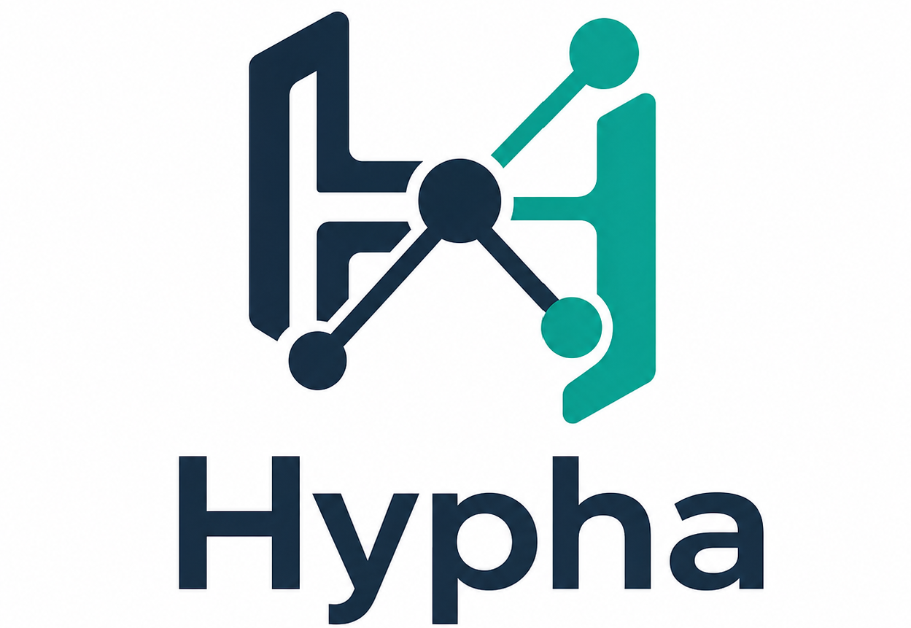

<p align="center">
  
</p>

<h1 align="center">hypha</h1>

<p align="center">
  <strong>面向生产级 LLM Agent 应用的 harness-oriented agent system framework。</strong>
</p>

<p align="center">
  <a href="README.md">English</a> | 中文
</p>

## 概览

hypha 是一个基于 TypeScript 的 LLM Agent 系统框架，用于通过稳定 API 构建可运行、可追踪、可回放、可治理、可评估、可扩展的 agent system。

框架将可复用的 agent-system 契约和展示媒介分离。API Server、CLI 和 Web 客户端都应作为同一套框架模型的调用入口，而不是核心运行时行为的定义位置。

## 核心模型

hypha 采用 ReAct + FSM 执行模型。ReAct 描述 agent 的观察、推理、行动、观察结果和验证循环；FSM 将这个循环显式表达为状态、受 guard 控制的转移、重试、trace event 和终态结果。

运行时模型以事件为先：

- `DomainPack` 声明领域级定义，包括任务结构、WorkflowSpec、工具、MCP profile、memory profile、skill policy、权限、评估规则和输出契约。
- `Session` 是运行时的用户或业务上下文容器，可以引用某个 DomainPack，并按 SessionProfile 初始化 metadata。
- `Run` 是 Session 下的一次具体执行实例。
- `Event` 是最小事实记录。trace、replay、audit、regression 和 state projection 都从 events 派生。

包级运行时提供 `FSMRuntime`、`ReActAgentRunner`、`RunManager` 和 `HarnessedReActFSMRunner`，用于执行带治理和 trace 的最小 agent 状态闭环。异常恢复同样由 FSM 显式管理：有界重试与熔断等待进入 `Recovering`，已提交副作用进入 `Compensating`，提交状态不确定的副作用进入 `Quarantined`。

## API 文档

公开文档以 API 和字段说明为主：

- [文档索引](docs/README.md)：架构、包边界、指南和 API reference 的入口。
- [HTTP API](docs/api/http.md)：REST endpoint、鉴权方式、请求体、响应结构和运行时约定。
- [Framework API](docs/api/framework.md)：DomainPack、Session、Run、Event、execution、inference、memory、tool、MCP、skill 和 model provider 的 TypeScript 契约。
- [Execution 契约](docs/architecture/execution.md)：provider-neutral 的 Workspace、Sandbox、Command、Store、Event 与 cache fingerprint 边界。
- [架构说明](docs/reference/architecture.md)：package 职责、harness 语义、runtime 模型和扩展边界。
- [Storage](docs/reference/storage.md)：document、messaging、relational、vector 和 artifact 存储在本地、自托管、托管云部署中的配置约定。
- [Domain Pack 指南](docs/guides/domain-packs.md)：声明 workflow、tool、memory、skill、policy、评估和输出契约的字段约定与示例。

服务启动后，也可以访问 `/api/v1/docs` 查看运行时路由索引。

## 运行模式

hypha 默认采用单用户运行模式，适合本地和自托管部署。系统会根据 `auth.singleUser` 准备 owner 账号，公开注册默认关闭；只有显式启用多用户模式时才开放注册。

内部 API 仍保留 `userId` 边界，用于 session、memory、token usage、API key 和 session queue。这样默认部署保持简单，同时保留多用户客户端需要的并发模型。

## 受治理的 Runtime

`@hypha/core` 提供以事件为先的编排契约与本地参考实现，使 FSM 任务无需隐藏循环即可运行。
Runtime 包含版本化 Event Schema 与 upcaster、带乐观并发的事件流追加、projection、按 scope 隔离的
session command、message inbox/outbox、带 fencing 的 run lease 与 state claim、共享/独占资源声明、
确定性 helper、timer、pause/resume/signal 控制、取消、checkpoint、恢复、replay 与 query service。
`@hypha/harness` 提供有界 FSM driver 与 execution context，同时确保 DomainPack workflow、provider
adapter 和应用状态不进入 Runtime core。

每条 command 和持久化操作都以 user、session 与 run 身份为边界。系统使用 revision、lease、claim、
Event 与 checkpoint 证据防止 stale worker 或重复循环被误判为有效进展。详见
[Runtime 模型](docs/reference/runtime-model.md)与 [Framework API](docs/api/framework.md)。

## 跨模块协同恢复

Hypha 使用同一套 FSM 恢复契约协调 inference、tool、MCP、memory、execution、storage、消息投递、policy 与 cache 异常。参与模块按依赖顺序执行，已经完成的上游不会重复运行；系统通过稳定的 receipt、revision、hash 或 provider state 判断是否真正取得进展，而不是把再次循环视为进展。有界重试、对账、兼容 fallback、降级、补偿、人工复核、隔离、取消和失败都具有显式策略与 trace event。

写入结果不确定时必须先对账再决定是否重放。可选 cache 失败时可以 bypass，但不能改变源操作结果；WorkCache 只保存与 policy/spec/provider revision 匹配并重新校验过的恢复知识，用作加速提示。Event log 与 FSM snapshot 始终是真相源。详见 [FSM 异常恢复](docs/architecture/fsm-recovery.md)。

## Inference Runtime

Agent inference 由 `@hypha/inference` 提供：prompt 编译、prefix 分段、Plasmod cache 协调、backend 路由和统一响应。默认物理 backend 是 SGLang，同时通过同一套 backend registry 支持 vLLM、llama.cpp 和 OpenAI API。

默认 backend 与 endpoint 在 `config.yaml` 或 `.env` 中配置，例如 `HYPHA_INFERENCE_DEFAULT_BACKEND=sglang` 和 `SGLANG_BASE_URL=http://localhost:30000`。

## Serving Cache

Hypha Serving Cache 是 LLM provider 调用前后的轻量 middleware。它提供 exact request-level cache、确定性 cache key、可插拔 store、cache policy、prompt prefix metadata 和 trace event，不改变 agent runtime 或 Domain Pack 接口。

exact cache key 来自已解析的 provider、model、system 或 prefix content、messages、tools/function schema、生成参数，以及可选 scope 字段，例如 `userId`、`sessionId`、`projectId` 和 `domainPackId`。`requestId`、timestamp 和 `undefined` 值不会进入 key。

通过 `HYPHA_SERVING_CACHE=memory` 或 `HYPHA_SERVING_CACHE=sqlite` 开启；默认 `off` 会保持 provider 原路径。`HYPHA_SERVING_CACHE_MODE` 支持 `off`、`read`、`write` 和 `readwrite`，`HYPHA_SERVING_CACHE_TTL_MS` 控制过期时间，SQLite 文件路径由 `HYPHA_SERVING_CACHE_SQLITE_PATH` 设置。

运行时 trace 可能包含 `llm.cache.lookup`、`llm.cache.hit`、`llm.cache.miss`、`llm.cache.write` 和 `llm.cache.bypass`。当前版本中 streaming request 会 bypass cache。本层不实现 semantic cache、cache tree、WorkCache 调度、provider KV cache 管理或 CPU/GPU cache migration。

## 受治理的 Tool 与 MCP

Local、HTTP、Plugin、Mock 与 MCP capability 统一通过 `ToolAdapter`、`ToolRegistry` 和 `GovernedToolRunner` 执行。每次调用都会形成可持久化的 Invocation，并统一处理 schema、permission、policy、人工审批、幂等、重试、超时、取消、artifact、event、observation、cache validity 与恢复语义。

动态 MCP capability 的连接状态、catalog、trust、drift、schema cache 与 Run contract snapshot 相互分离。运行中的 Run 使用不可变 snapshot，远端 capability 变化不会静默替换当前执行或 replay 使用的契约。

参见 [Tool/MCP 架构](docs/architecture/tool-mcp.md)、[安全指南](docs/guides/tool-mcp-security.md) 与 [Adapter 指南](docs/guides/tool-adapters.md)。

服务端内置受治理、无副作用的 `utility.json`、`utility.text` 与 `utility.hash`，用于有边界的 JSON 处理、字面文本变换和 SHA-256 指纹。参见[通用工具指南](docs/guides/common-utility-tools.md)与 [FSM 异常恢复架构](docs/architecture/fsm-recovery.md)。

## 受治理的 Execution 契约

`@hypha/core` 提供 provider-neutral 的受管 Workspace、sandbox environment、command execution、带 revision 的 record/lease、生命周期 event 与确定性 cache fingerprint 契约。文件系统、进程、容器、远端 provider、存储、artifact、policy 与 secret 的具体实现都保留在 adapter 和 harness 边界之后。Adapter 执行副作用之前，框架会验证路径、身份、状态转换、终态证据、敏感事件字段、幂等边界与 stale-writer fencing。

Runtime 通过经过验证的 `ExecutionActivityRequest` 进入 Execution 边界；请求会绑定 Run、FSM state
attempt、Workspace、fencing token、deadline、principal 与幂等身份。`DefaultExecutionRiskEvaluator`
生成 provider-neutral 风险证据，`GovernedExecutionPort` 则在 dispatch 前验证 Tool binding、权限 scope、
Policy/Human Approval 证据、取消状态、deadline 与授权有效期。所有非成功 Activity 终态都必须携带
标准化错误和持久 Event 引用。

`DefaultExecutionOutputPlanner` 确定性筛选有界、content-addressed 的 Workspace mutation；
`DefaultExecutionOutputCollector` 仅在返回记录与计划中的 hash、size、path、principal、user、tenant、
Workspace、Run、provenance 和 Artifact version 全部一致时创建或 finalize Artifact。这些能力是框架
port，不代表内置了某个容器、云对象存储或远端 Execution Provider。

Artifact 生命周期采用 content-addressed、append-only 语义。`DefaultArtifactManager` 及其 eventing
wrapper 通过 principal-scoped policy 管理创建、读取、列表、版本导航、lineage、retention、垃圾回收
与下载授权。框架提供内存、本地文件和 SQLite 参考组件；具体云 Provider 仍属于 Adapter 扩展，
core contract 不承诺未实现的云端能力。

契约分层与扩展规则参见 [Execution 架构](docs/architecture/execution.md)。

## 受治理的 Memory 与 Context

`@hypha/memory` 提供版本化 Memory profile、principal/user/workspace scope 隔离、乐观并发版本、
scope 级幂等、结构化历史、record 与 index outbox 原子持久化、确定性检索解释、生命周期 worker
和有界 Context 构建。Native provider 以结构化记录为真相源，向量索引通过带 lease 和有界重试的
outbox 异步更新。hard delete 会同时清除当前记录与历史版本；外部 provider adapter 必须保留
scope metadata，并在不确定写入重放前完成对账。

Memory、Context、Domain、Cache、Replay 与 Evaluation 通过版本化依赖和 validity snapshot 协同。
Context builder 在注入模型前执行 policy、provenance、token budget、确定性压缩以及指令/数据边界。
详见[受治理的 Memory 架构](docs/architecture/memory.md)。

## 开发命令

```bash
npm install
npm run dev
npm run build
npm run typecheck
npm test
npm run lint
npm run cli -- --help
```

- `npm run dev`：使用 dotenv 启动 Express API server。
- `npm run build`：编译 framework packages、API server 和 CLI。
- `npm test`：运行 unit、package 和 integration 测试套件。
- `npm run cli -- --help`：查看 CLI client 命令。

## 支持协议

MIT
